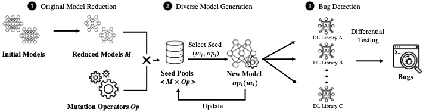

# MEMO: Coverage-guided Model Generation For Deep Learning Library Testing

## Overview

MEMO is a coverage-guided deep learning (DL) library testing tool.

## Experiment

### DL Models

In the submitted paper, MEMO used 10 publicly-available DL models as the initial seed model for model generation. These DL models can be accessed through [here](https://drive.google.com/drive/folders/1d6rk80UvqcRtc6voN3jaux3wTbmUAYaI?usp=sharing).

